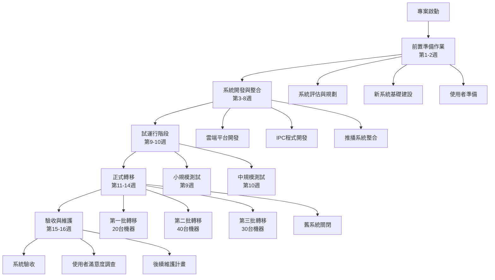
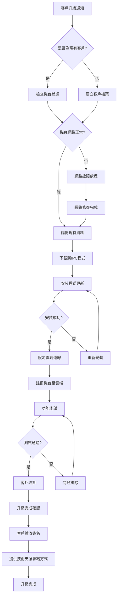
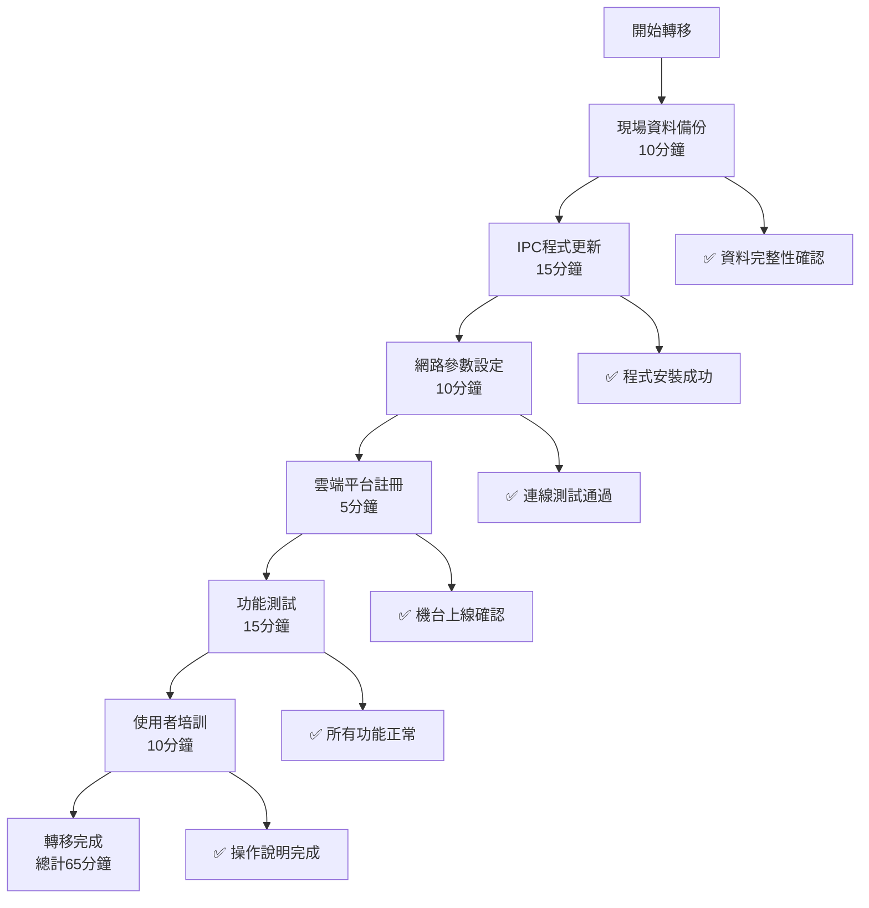
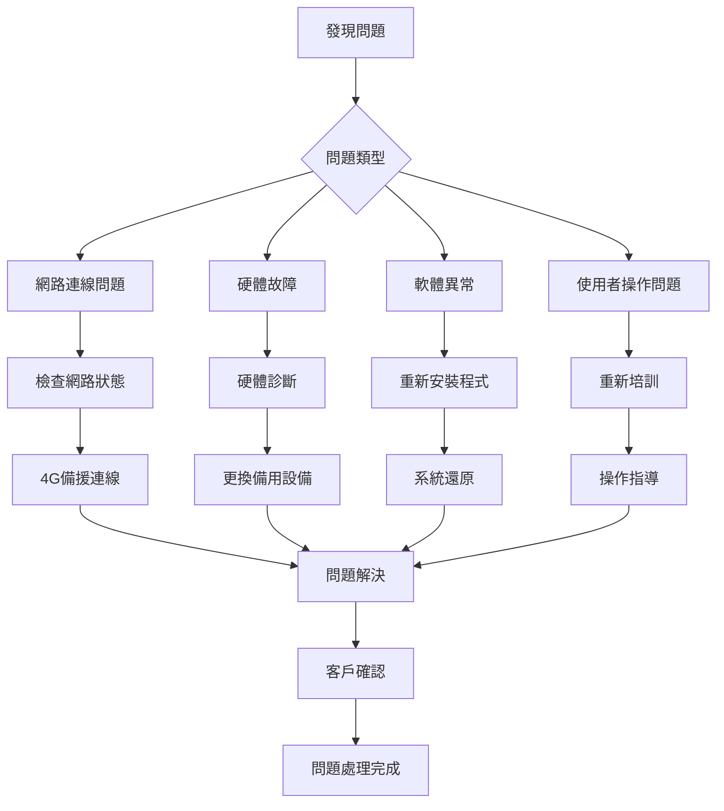
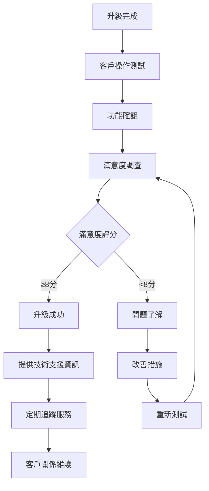
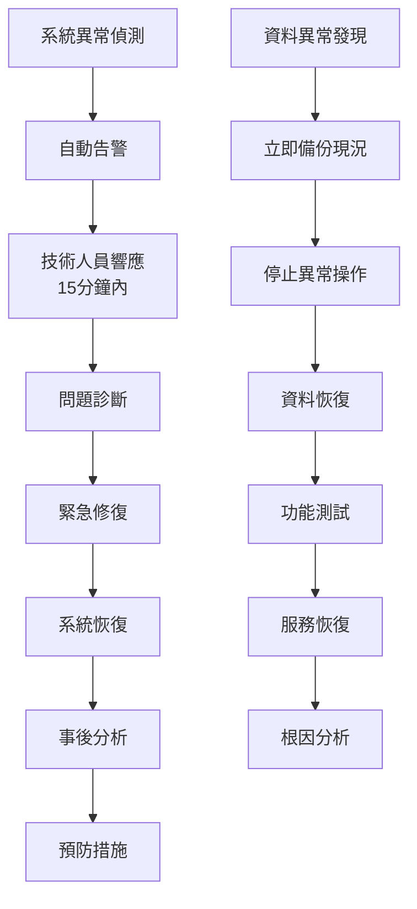

# 客戶升級SOP流程圖

## 系統升級總體流程圖

```mermaid
graph TD
    A[專案啟動] --> B[前置準備作業<br/>第1-2週]
    B --> C[系統開發與整合<br/>第3-8週]
    C --> D[試運行階段<br/>第9-10週]
    D --> E[正式轉移<br/>第11-14週]
    E --> F[驗收與維護<br/>第15-16週]
    
    B --> B1[系統評估與規劃]
    B --> B2[新系統基礎建設]
    B --> B3[使用者準備]
    
    C --> C1[雲端平台開發]
    C --> C2[IPC程式開發]
    C --> C3[推播系統整合]
    
    D --> D1[小規模測試<br/>第9週]
    D --> D2[中規模測試<br/>第10週]
    
    E --> E1[第一批轉移<br/>20台機器]
    E --> E2[第二批轉移<br/>40台機器]
    E --> E3[第三批轉移<br/>30台機器]
    E --> E4[舊系統關閉]
    
    F --> F1[系統驗收]
    F --> F2[使用者滿意度調查]
    F --> F3[後續維護計畫]
```

## 客戶升級操作流程

```mermaid
graph TD
    A[客戶升級通知] --> B{是否為現有客戶?}
    B -->|是| C[檢查機台狀態]
    B -->|否| D[建立客戶檔案]
    
    C --> E{機台網路正常?}
    D --> E
    
    E -->|是| F[備份現有資料]
    E -->|否| G[網路故障處理]
    G --> H[網路修復完成]
    H --> F
    
    F --> I[下載新IPC程式]
    I --> J[安裝程式更新]
    J --> K{安裝成功?}
    
    K -->|是| L[設定雲端連線]
    K -->|否| M[重新安裝]
    M --> J
    
    L --> N[註冊機台至雲端]
    N --> O[功能測試]
    O --> P{測試通過?}
    
    P -->|是| Q[客戶培訓]
    P -->|否| R[問題排除]
    R --> O
    
    Q --> S[升級完成確認]
    S --> T[客戶驗收簽名]
    T --> U[提供技術支援聯絡方式]
    U --> V[升級完成]
```

## 單台機器轉移詳細流程

```mermaid
graph TD
    A[開始轉移] --> B[現場資料備份<br/>10分鐘]
    B --> C[IPC程式更新<br/>15分鐘]
    C --> D[網路參數設定<br/>10分鐘]
    D --> E[雲端平台註冊<br/>5分鐘]
    E --> F[功能測試<br/>15分鐘]
    F --> G[使用者培訓<br/>10分鐘]
    G --> H[轉移完成<br/>總計65分鐘]
    
    B --> B1[✅ 資料完整性確認]
    C --> C1[✅ 程式安裝成功]
    D --> D1[✅ 連線測試通過]
    E --> E1[✅ 機台上線確認]
    F --> F1[✅ 所有功能正常]
    G --> G1[✅ 操作說明完成]
```

## 問題處理流程

```mermaid
graph TD
    A[發現問題] --> B{問題類型}
    
    B --> C[網路連線問題]
    B --> D[硬體故障]
    B --> E[軟體異常]
    B --> F[使用者操作問題]
    
    C --> C1[檢查網路狀態]
    C1 --> C2[4G備援連線]
    C2 --> G[問題解決]
    
    D --> D1[硬體診斷]
    D1 --> D2[更換備用設備]
    D2 --> G
    
    E --> E1[重新安裝程式]
    E1 --> E2[系統還原]
    E2 --> G
    
    F --> F1[重新培訓]
    F1 --> F2[操作指導]
    F2 --> G
    
    G --> H[客戶確認]
    H --> I[問題處理完成]
```

## 客戶滿意度確認流程

```mermaid
graph TD
    A[升級完成] --> B[客戶操作測試]
    B --> C[功能確認]
    C --> D[滿意度調查]
    
    D --> E{滿意度評分}
    E --> |≥8分| F[升級成功]
    E --> |<8分| G[問題了解]
    
    G --> H[改善措施]
    H --> I[重新測試]
    I --> D
    
    F --> J[提供技術支援資訊]
    J --> K[定期追蹤服務]
    K --> L[客戶關係維護]
```

## 緊急應變流程

```mermaid
graph TD
    A[系統異常偵測] --> B[自動告警]
    B --> C[技術人員響應<br/>15分鐘內]
    C --> D[問題診斷]
    D --> E[緊急修復]
    E --> F[系統恢復]
    F --> G[事後分析]
    G --> H[預防措施]
    
    I[資料異常發現] --> J[立即備份現況]
    J --> K[停止異常操作]
    K --> L[資料恢復]
    L --> M[功能測試]
    M --> N[服務恢復]
    N --> O[根因分析]
```

---

**此流程圖提供客戶升級過程的視覺化指導，確保每個步驟都能順利執行並達到預期效果。**