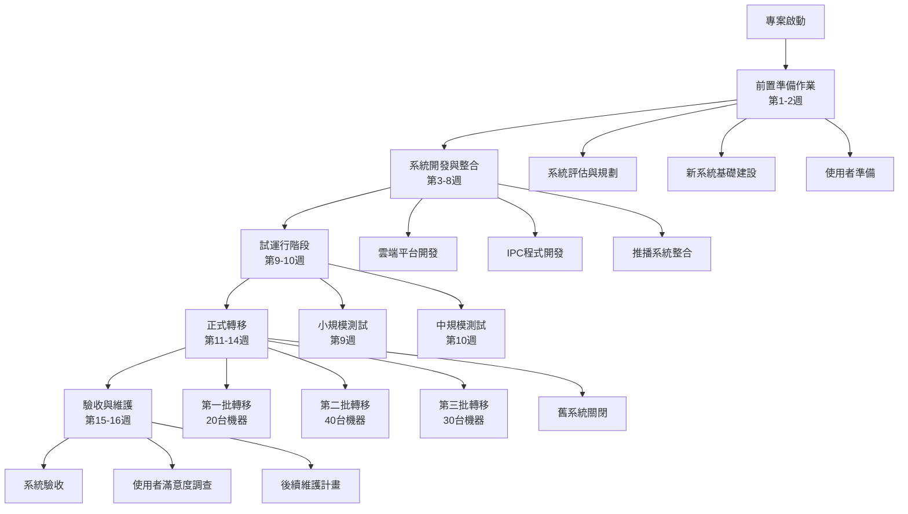
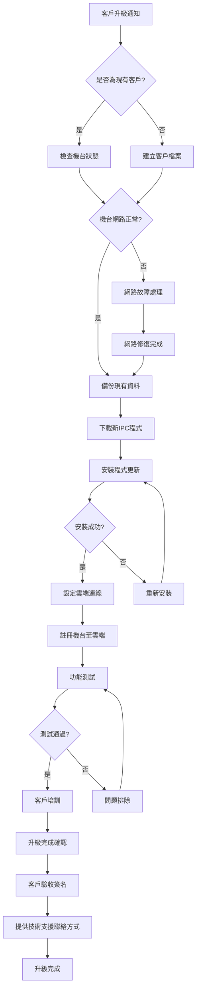
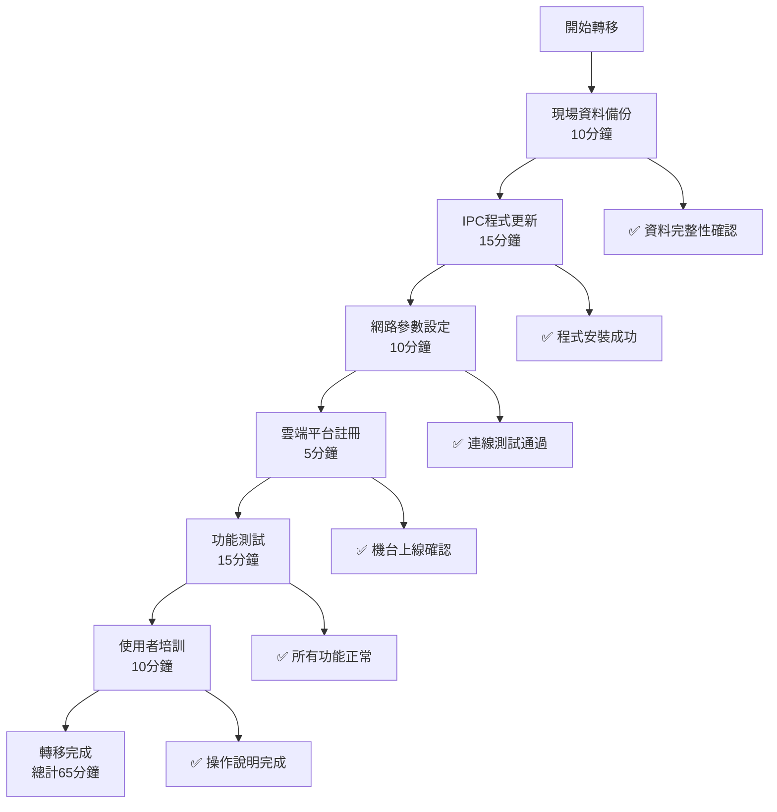
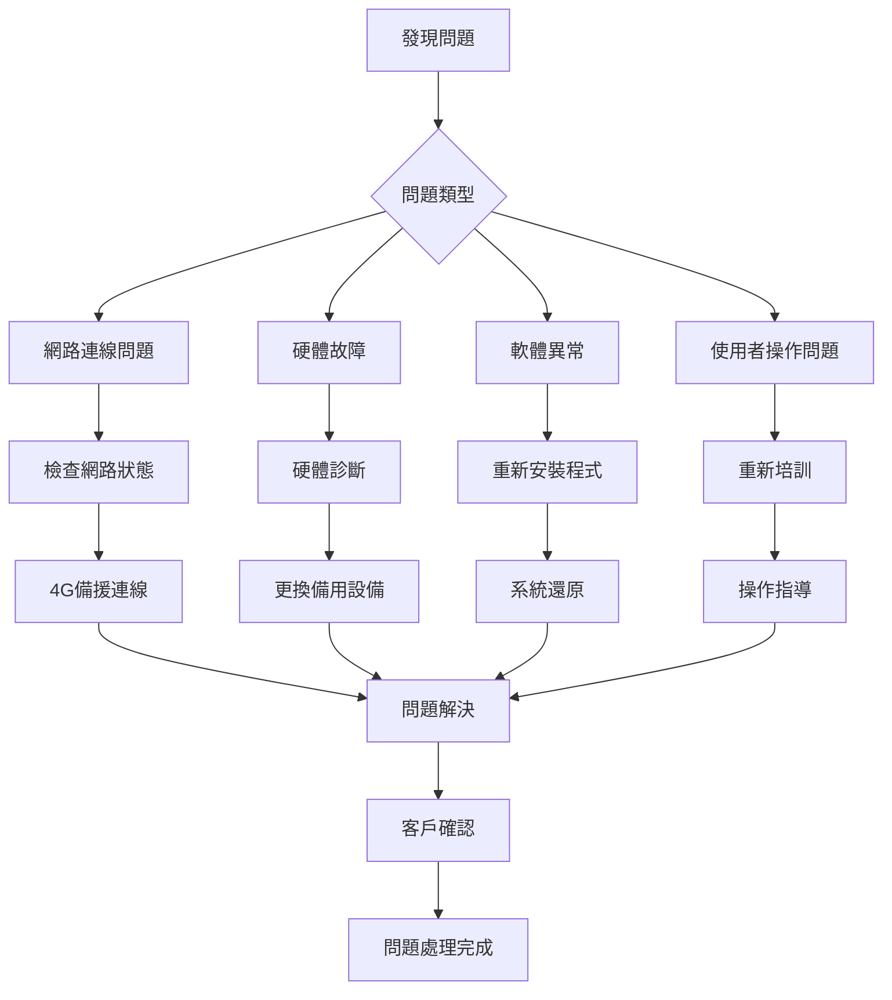
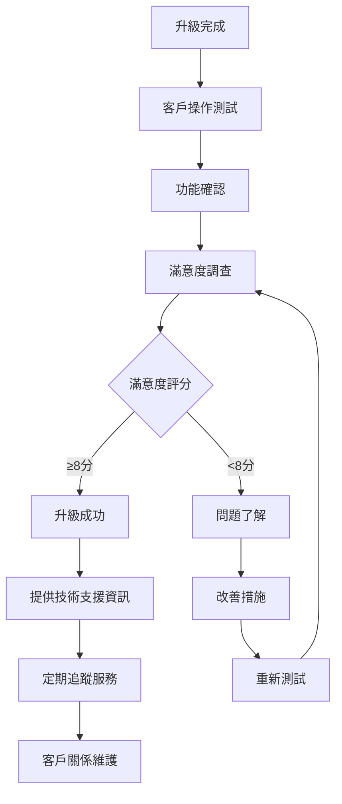
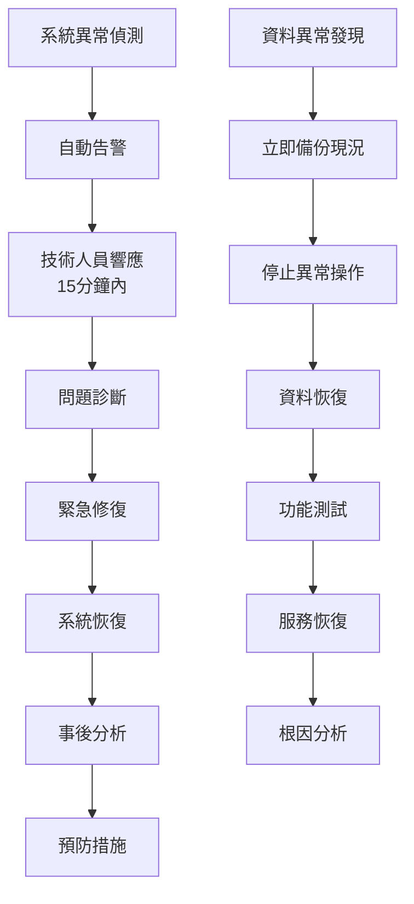

# 客戶升級完整指南

## 🎯 升級概述

親愛的客戶，我們即將為您的兌幣機系統進行重大升級，從現有的LINE推播系統轉移至更先進的Telegram雲服務系統。此次升級將帶來更穩定的服務、更豐富的功能，以及更好的使用體驗。

### 升級效益
- ✅ **更穩定的雲端服務**：99.9%系統可用率
- ✅ **即時監控功能**：隨時掌握機台狀態
- ✅ **遠端補幣操作**：無需現場即可補充代幣
- ✅ **詳細交易記錄**：完整的營運數據分析
- ✅ **智能推播通知**：重要事件即時通知

## 📅 升級時程安排

### 階段一：準備階段 (升級前2週)
- 系統評估與規劃
- 新系統基礎建設
- 使用者帳號準備

### 階段二：開發整合 (第3-8週)
- 雲端平台開發
- 硬體程式更新
- 系統整合測試

### 階段三：試運行 (第9-10週)
- 小規模功能測試
- 中規模壓力測試
- 問題修正與優化

### 階段四：正式轉移 (第11-14週)
**您的機台將在此階段完成升級**
- 分三批次進行轉移
- 每台機器約需65分鐘
- 專人現場技術支援

## 📊 系統升級總體流程圖



## 🔄 客戶升級操作流程



### 您的升級流程
```
1. 技術人員到場 → 2. 資料備份(10分鐘) → 3. 程式更新(15分鐘)
                ↓
4. 網路設定(10分鐘) → 5. 系統註冊(5分鐘) → 6. 功能測試(15分鐘)
                ↓
7. 操作培訓(10分鐘) → 8. 驗收確認 → 9. 升級完成
```

### 您需要配合的事項
- ✅ 確保機台電源正常
- ✅ 維持網路連線穩定
- ✅ 安排人員參與操作培訓
- ✅ 準備Telegram帳號（我們將協助設定）
- ✅ 在驗收單上簽名確認

## 📋 單台機器轉移詳細流程



## 📱 新系統主要功能

### 1. Telegram機器人通知
- 自動接收機台狀態更新
- 異常情況即時告警
- 交易完成通知
- 維護提醒訊息

### 2. 雲端管理介面
- 即時查看機台狀態
- 遠端執行補幣操作
- 查看詳細交易記錄
- 營運數據分析報表

### 3. 智能監控系統
- 24小時自動監控
- 異常自動診斷
- 預防性維護提醒
- 系統效能優化

## 🛠️ 操作變更說明

### 升級前 (LINE系統)
- 透過LINE接收推播訊息
- 人工記錄交易數據
- 現場檢查機台狀態
- 手動進行補幣作業

### 升級後 (Telegram雲端系統)
- 透過Telegram Bot接收訊息
- 自動記錄並分析數據
- 遠端即時監控狀態
- 一鍵完成遠端補幣

## 🚨 問題處理流程



## 📈 客戶滿意度確認流程



## 📚 培訓與支援

### 現場培訓內容 (10分鐘)
1. **Telegram Bot使用**
   - 如何加入機器人
   - 訊息類型說明
   - 基本指令操作

2. **雲端介面介紹**
   - 登入方式
   - 主要功能頁面
   - 常用操作流程

3. **問題處理方法**
   - 常見問題自主排除
   - 客服聯絡方式
   - 緊急處理流程

### 技術支援服務
- 🔧 **技術熱線**：專業工程師24小時待命
- 💬 **線上客服**：即時解答操作疑問
- 📖 **操作手冊**：詳細的圖文說明指南
- 🎥 **教學影片**：實際操作示範影片

## ⚠️ 注意事項

### 升級期間
- 機台將暫停服務約65分鐘
- 建議安排在營業離峰時段進行
- 請確保現場有工作人員配合
- 網路不穩定可能延長升級時間

### 升級完成後
- 原有LINE通知將停止服務
- 所有通知改由Telegram發送
- 登入帳號密碼將另行提供
- 建議先熟悉新系統操作

### 資料安全保障
- 所有交易資料完整備份
- 升級過程採用加密傳輸
- 雲端儲存多重備援保護
- 符合資訊安全管理標準

## 🆘 緊急應變流程



## 📞 聯絡資訊

### 升級專案聯絡人
- **專案經理**：張小姐 (02-1234-5678)
- **技術主管**：李先生 (0912-345-678)
- **客服專線**：(02-8765-4321)
- **緊急支援**：24小時技術熱線 (0800-123-456)

### 升級進度查詢
- 📧 **Email**：upgrade@example.com
- 💻 **官網**：www.example.com/upgrade
- 📱 **客服Line**：@upgrade_support

## ✅ 升級確認清單

### 升級前準備
- [ ] 確認升級日期時間
- [ ] 準備Telegram帳號
- [ ] 安排現場配合人員
- [ ] 確保機台電源網路正常

### 升級過程確認
- [ ] 資料備份完成
- [ ] 程式安裝成功
- [ ] 網路連線正常
- [ ] 雲端註冊完成
- [ ] 功能測試通過
- [ ] 操作培訓完成

### 升級後驗收
- [ ] 所有功能正常運作
- [ ] Telegram通知正常接收
- [ ] 雲端介面可正常登入
- [ ] 遠端補幣功能正常
- [ ] 客戶滿意度達8分以上

## 🎉 升級完成效益

升級完成後，您將享受到：

### 營運效率提升
- 🚀 **監控效率**：從人工巡檢到即時監控
- 💰 **成本節省**：減少90%以上人力成本
- ⏱️ **回應速度**：異常處理時間縮短80%

### 使用體驗優化
- 📊 **數據分析**：完整的營運報表
- 🔔 **智能通知**：個人化推播設定
- 🎯 **精準管理**：遠端操作一鍵完成

### 系統穩定性
- 🛡️ **高可用性**：99.9%系統正常運行
- 🔄 **自動備援**：網路中斷自動切換
- 🔧 **快速復原**：故障後15分鐘內恢復

---

**感謝您對我們系統升級的支持與配合，我們承諾提供最優質的服務，確保升級過程順利進行！**

*如有任何疑問，請隨時聯絡我們的專業團隊。*