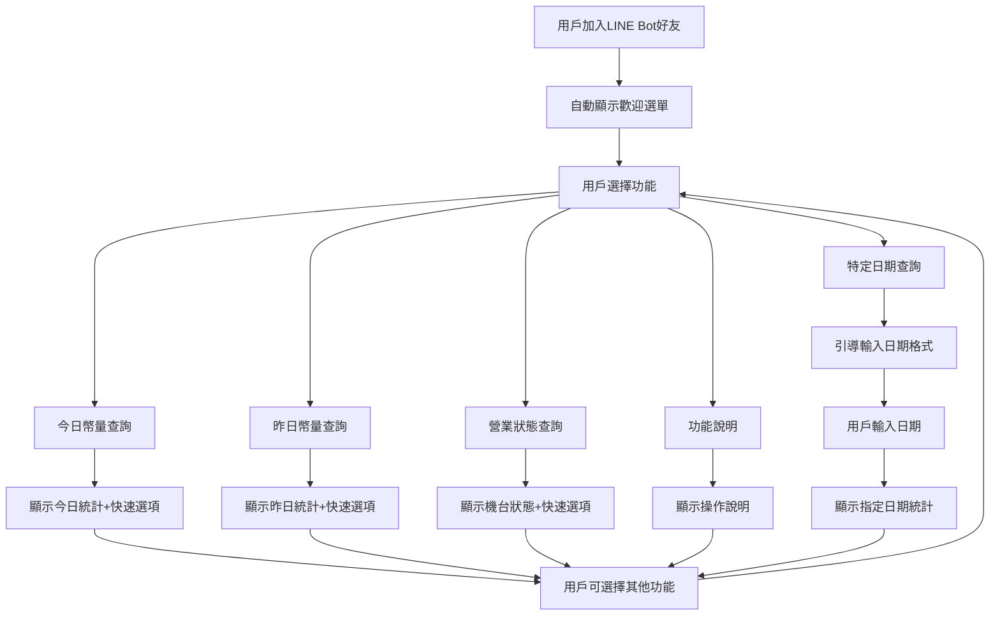

# LINE Bot對話互動功能設計規範

## 📱 功能概述

為兌幣機雲服務系統設計LINE Bot對話互動功能，讓用戶透過簡單的對話方式查詢機台狀態、幣量統計等資訊。**採用對話互動模式，不使用主動推播功能。**

## 🔄 LINE Bot對話互動流程



## 💬 LINE Bot對話介面設計

### 1. 歡迎訊息與主選單

#### 觸發時機
- 用戶首次加入LINE Bot好友
- 用戶發送「選單」、「menu」等關鍵字

#### 訊息設計
```
🎰 歡迎使用 IOTCoinChanger 查詢系統！

透過簡單的對話，您可以隨時查詢：
📊 機台幣量統計
🏪 營業狀態監控  
📅 歷史資料查詢

請點擊下方按鈕開始使用：
```

#### 快速回復按鈕
- 📊 今日幣量
- 📊 昨日幣量  
- 🏪 營業狀態
- 📅 查詢日期
- ❓ 功能說明

### 2. 今日幣量查詢回應

#### 觸發關鍵字
`今日幣量`、`今天`、`today`、點擊「今日幣量」按鈕

#### 回應訊息格式
```
📊 今日幣量查詢結果
─────────────────
🗓️ 日期: 2024-01-15
💰 總幣量: 15,600元

🎰 機台詳情：
• 機台01: 3,200元 ✅ 正常
• 機台02: 4,100元 ✅ 正常  
• 機台03: 2,800元 ❌ 故障
• 機台04: 5,500元 ✅ 正常

─────────────────
📈 與昨日對比: +2,300元 (↑17.3%)
⏰ 更新時間: 16:30

💡 輸入「選單」查看其他功能
```

#### 後續快速選項
- 📊 昨日幣量  
- 🏪 營業狀態
- 📅 查詢其他日期
- 🔄 重新查詢

### 3. 昨日幣量查詢回應

#### 觸發關鍵字
`昨日幣量`、`昨天`、`yesterday`、點擊「昨日幣量」按鈕

#### 回應訊息格式
```
📊 昨日幣量查詢結果
─────────────────
🗓️ 日期: 2024-01-14 (週日)
💰 總幣量: 13,300元

🎰 機台詳情：
• 機台01: 2,800元 ✅ 正常
• 機台02: 3,900元 ✅ 正常
• 機台03: 2,600元 ✅ 正常  
• 機台04: 4,000元 ✅ 正常

─────────────────
📈 與前日對比: +1,100元 (↑9.0%)
📊 週日表現良好
⏰ 統計時間: 23:59

💡 輸入「選單」查看其他功能
```

#### 後續快速選項
- 📊 今日幣量
- 🏪 營業狀態  
- 📅 查詢其他日期
- 🔄 重新查詢

### 4. 營業狀態查詢回應

#### 觸發關鍵字
`營業狀態`、`狀態`、`status`、`機台狀態`、點擊「營業狀態」按鈕

#### 回應訊息格式
```
🏪 機台營業狀態總覽
─────────────────
⏰ 查詢時間: 2024-01-15 16:30

🎰 機台狀態詳情：
• 機台01: ✅ 正常營業 (運行中)
• 機台02: ✅ 正常營業 (運行中)
• 機台03: ❌ 故障停機 (硬體異常)  
• 機台04: ✅ 正常營業 (運行中)

─────────────────
📊 統計摘要：
✅ 正常機台: 3台 (75%)
❌ 故障機台: 1台 (25%)  
🔋 總服務能力: 75%

💡 故障機台已通知維修
💡 輸入「選單」查看其他功能
```

#### 後續快速選項
- 📊 今日幣量
- 📊 昨日幣量
- 📅 查詢其他日期  
- 🔄 重新查詢

### 5. 特定日期查詢流程

#### 觸發關鍵字
`查詢特定日期`、`查詢日期`、`日期查詢`、點擊「查詢日期」按鈕

#### 第一步：引導輸入格式
```
📅 特定日期幣量查詢

請輸入您要查詢的日期：
格式: YYYY-MM-DD
例如: 2024-01-10

或選擇快速查詢：
```

#### 快速選項
- 昨日 (2024-01-14)
- 前日 (2024-01-13)  
- 一週前 (2024-01-08)
- 返回選單

#### 第二步：用戶輸入日期後回應
```
📊 2024-01-10 幣量查詢結果
─────────────────
🗓️ 日期: 2024-01-10 (週三)
💰 總幣量: 11,850元

🎰 機台詳情：
• 機台01: 2,400元 ✅ 正常
• 機台02: 3,200元 ✅ 正常
• 機台03: 2,950元 ✅ 正常
• 機台04: 3,300元 ✅ 正常  

─────────────────
📈 與前日對比: +850元 (↑7.7%)
📊 週三表現穩定
⏰ 統計時間: 23:59

💡 輸入其他日期或「選單」繼續查詢
```

### 6. 功能說明頁面

#### 觸發關鍵字
`功能說明`、`說明`、`help`、`指令`、點擊「功能說明」按鈕

#### 回應訊息
```
❓ IOTCoinChanger Bot 功能說明
─────────────────

💬 對話指令：
• 輸入「今日幣量」或「今天」→ 查詢當日統計
• 輸入「昨日幣量」或「昨天」→ 查詢昨日統計  
• 輸入「營業狀態」或「狀態」→ 查詢機台狀態
• 輸入日期 (如: 2024-01-10) → 查詢指定日期
• 輸入「選單」→ 顯示功能選單

📱 快速按鈕：
每次查詢後都會提供相關快速按鈕，
點擊即可快速切換到其他功能

⏰ 查詢時間：
24小時全天候可查詢，資料每5分鐘更新

💡 小貼士：
- 支援自然語言，可直接說「今天收了多少」
- 可隨時輸入「選單」回到主功能
- 查詢結果會顯示與前日對比
- 故障機台會特別標示❌

有其他問題請輸入「選單」選擇功能
```

## 🔧 技術實作規範

### LINE Bot Webhook 處理邏輯

```javascript
// LINE Bot 訊息處理核心邏輯
const handleLineMessage = async (event) => {
    const userMessage = event.message.text;
    const userId = event.source.userId;
    
    // 關鍵字匹配與處理
    if (isKeywordMatch(userMessage, ['今日幣量', '今天', 'today'])) {
        return await getTodayCoinsResponse();
    }
    
    if (isKeywordMatch(userMessage, ['昨日幣量', '昨天', 'yesterday'])) {
        return await getYesterdayCoinsResponse();
    }
    
    if (isKeywordMatch(userMessage, ['營業狀態', '狀態', 'status'])) {
        return await getBusinessStatusResponse();
    }
    
    if (isKeywordMatch(userMessage, ['選單', 'menu', '功能'])) {
        return getMainMenuResponse();
    }
    
    if (isKeywordMatch(userMessage, ['功能說明', 'help', '說明'])) {
        return getFunctionHelpResponse();
    }
    
    // 日期格式檢查
    if (isValidDateFormat(userMessage)) {
        return await getDateSpecificResponse(userMessage);
    }
    
    // 自然語言處理
    if (containsNaturalKeywords(userMessage)) {
        return await handleNaturalLanguage(userMessage);
    }
    
    // 預設回應
    return getDefaultResponse();
};

// 輔助函數
const isKeywordMatch = (userMessage, keywords) => {
    return keywords.some(keyword => 
        userMessage.toLowerCase().includes(keyword.toLowerCase())
    );
};

const isValidDateFormat = (message) => {
    const dateRegex = /^\d{4}-\d{2}-\d{2}$/;
    return dateRegex.test(message.trim());
};

// 快速回復按鈕生成
const createQuickReply = (items) => {
    return {
        type: "text",
        text: "請選擇功能：",
        quickReply: {
            items: items.map(item => ({
                type: "action",
                action: {
                    type: "message",
                    label: item.label,
                    text: item.text
                }
            }))
        }
    };
};
```

### 訊息回應模板

```javascript
// 主選單回應模板
const getMainMenuResponse = () => {
    const quickReplyItems = [
        { label: "📊 今日幣量", text: "今日幣量" },
        { label: "📊 昨日幣量", text: "昨日幣量" },
        { label: "🏪 營業狀態", text: "營業狀態" },
        { label: "📅 查詢日期", text: "查詢特定日期" },
        { label: "❓ 功能說明", text: "功能說明" }
    ];
    
    return {
        type: "text",
        text: "🎰 IOTCoinChanger 查詢系統\n請選擇查詢功能：",
        quickReply: createQuickReply(quickReplyItems).quickReply
    };
};

// 今日幣量回應模板
const getTodayCoinsResponse = async () => {
    const todayStats = await fetchTodayStatistics();
    
    const quickReplyItems = [
        { label: "📊 昨日幣量", text: "昨日幣量" },
        { label: "🏪 營業狀態", text: "營業狀態" },
        { label: "📅 查詢日期", text: "查詢特定日期" },
        { label: "🔄 重新查詢", text: "今日幣量" }
    ];
    
    return {
        type: "text",
        text: formatTodayStatsMessage(todayStats),
        quickReply: createQuickReply(quickReplyItems).quickReply
    };
};
```

### 資料格式化函數

```javascript
const formatTodayStatsMessage = (stats) => {
    const machines = stats.machines.map(machine => 
        `• ${machine.name}: ${machine.amount.toLocaleString()}元 ${machine.status === 'online' ? '✅' : '❌'} ${machine.statusText}`
    ).join('\n');
    
    const comparison = stats.comparison > 0 
        ? `+${stats.comparison.toLocaleString()}元 (↑${stats.comparisonPercent}%)`
        : `${stats.comparison.toLocaleString()}元 (↓${Math.abs(stats.comparisonPercent)}%)`;
    
    return `📊 今日幣量查詢結果
─────────────────
🗓️ 日期: ${stats.date}
💰 總幣量: ${stats.totalAmount.toLocaleString()}元

🎰 機台詳情：
${machines}

─────────────────
📈 與昨日對比: ${comparison}
⏰ 更新時間: ${stats.updateTime}

💡 輸入「選單」查看其他功能`;
};
```

## 📊 用戶體驗設計重點

### 對話流程設計原則
- **簡潔明瞭**: 每個回應都包含完整必要資訊
- **引導性**: 提供明確的下一步操作選項
- **一致性**: 所有訊息格式統一，易於理解
- **即時性**: 資料更新時間清楚標示

### 錯誤處理機制
- **無效日期**: 提供正確格式範例
- **無資料期間**: 解釋原因並提供建議查詢日期  
- **系統異常**: 友善提示並建議稍後重試
- **未知指令**: 引導回到主選單

### 用戶習慣考量  
- **保持LINE使用習慣**: 快速回復按鈕+對話輸入
- **支援自然語言**: 「今天收了多少」也能識別
- **記住查詢脈絡**: 相關功能的快速切換
- **24小時可用**: 隨時可查詢歷史資料

這個設計完全符合MVP需求，移除了主動推播功能，專注於用戶主動查詢的對話互動體驗。
