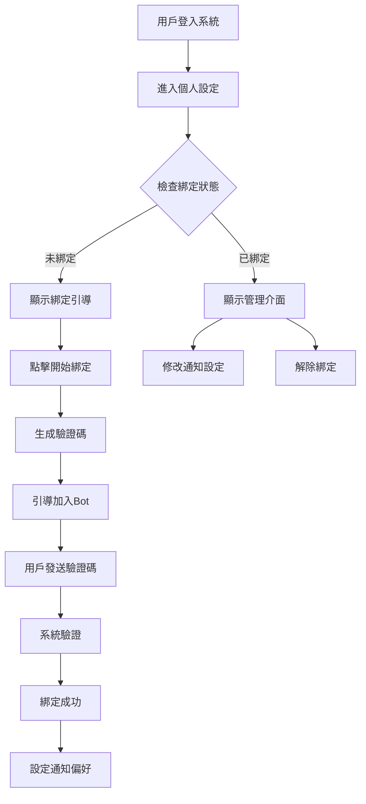

# Telegram綁定功能前端UI設計規範

## 📱 功能概述

為兌幣機雲服務系統新增Telegram帳號綁定功能，讓用戶能夠接收即時的機台狀態推播通知。

## 🔄 使用者綁定流程



## 🎨 頁面設計規範

### 1. 個人設定頁面 (`/user/settings`)

#### 頁面結構
```
📍 導航路徑：首頁 > 個人中心 > 帳號設定

🎯 功能目標：
- 顯示Telegram綁定狀態
- 提供綁定/解綁入口
- 快速存取通知設定
```

#### UI設計說明


**設計要點：**
- 採用卡片式設計，清楚區分不同設定區塊
- 使用綠色✅圖示表示已綁定狀態
- 使用橘色○圖示表示未綁定狀態
- 主要按鈕採用品牌色，次要按鈕使用灰色調

**HTML結構建議：**
```html
<div class="settings-container">
    <div class="settings-card">
        <h3 class="card-title">
            <i class="icon-bell"></i> 通知設定
        </h3>
        
        <!-- Telegram區塊 -->
        <div class="notification-item">
            <div class="item-info">
                <span class="service-icon">📱</span>
                <div class="service-details">
                    <h4>Telegram 通知</h4>
                    <p class="service-desc">即時接收機台狀態推播</p>
                </div>
            </div>
            
            <div class="item-status" v-if="!telegramBound">
                <span class="status unbound">○ 未綁定</span>
                <button class="btn btn-primary" @click="startBinding">
                    開始綁定
                </button>
            </div>
            
            <div class="item-status" v-else>
                <span class="status bound">✅ 已綁定</span>
                <span class="username">@{{ telegramUsername }}</span>
                <div class="action-buttons">
                    <button class="btn btn-secondary" @click="openSettings">
                        通知設定
                    </button>
                    <button class="btn btn-outline" @click="unbind">
                        解除綁定
                    </button>
                </div>
            </div>
        </div>
        
        <!-- Email區塊 -->
        <div class="notification-item">
            <div class="item-info">
                <span class="service-icon">📧</span>
                <div class="service-details">
                    <h4>Email 通知</h4>
                    <p class="service-desc">重要事件郵件提醒</p>
                </div>
            </div>
            <div class="item-status">
                <span class="status bound">✅ 已設定</span>
                <span class="email">{{ userEmail }}</span>
                <button class="btn btn-secondary">修改設定</button>
            </div>
        </div>
    </div>
</div>
```

### 2. Telegram綁定引導頁面 (`/user/telegram-binding`)

#### 頁面結構
```
📍 導航路徑：個人設定 > 開始綁定

🎯 功能目標：
- 引導用戶完成綁定流程
- 提供清晰的操作步驟
- 即時顯示綁定狀態
```

#### UI設計說明


**設計要點：**
- 採用步驟式引導設計
- 重要資訊使用高亮顯示
- 提供一鍵複製驗證碼功能
- 倒數計時器顯示驗證碼有效期

**HTML結構建議：**
```html
<div class="binding-wizard">
    <div class="wizard-header">
        <h2>📱 綁定 Telegram 帳號</h2>
        <p class="desc">完成綁定後，您將可以即時收到機台狀態通知</p>
    </div>
    
    <div class="wizard-steps">
        <!-- 步驟1 -->
        <div class="step-item">
            <div class="step-number">1</div>
            <div class="step-content">
                <h3>🤖 加入我們的 Bot</h3>
                <p>點擊下方按鈕加入 CoinChanger 通知機器人：</p>
                <a :href="botUrl" target="_blank" class="btn-telegram">
                    <i class="telegram-icon"></i>
                    加入 CoinChanger Bot
                </a>
            </div>
        </div>
        
        <!-- 步驟2 -->
        <div class="step-item">
            <div class="step-number">2</div>
            <div class="step-content">
                <h3>📝 發送綁定驗證碼</h3>
                <p>在 Telegram 中發送以下驗證碼給機器人：</p>
                
                <div class="verification-box">
                    <div class="code-display">
                        <span class="code">{{ verificationCode }}</span>
                        <button @click="copyCode" class="btn-copy">
                            <i class="icon-copy"></i> 複製
                        </button>
                    </div>
                    <div class="code-info">
                        <span class="timer">⏱️ 有效期：{{ remainingTime }}分鐘</span>
                        <span class="status">{{ bindingStatusText }}</span>
                    </div>
                </div>
            </div>
        </div>
    </div>
    
    <div class="wizard-actions">
        <button @click="regenerateCode" class="btn btn-outline" :disabled="isBinding">
            重新生成驗證碼
        </button>
        <button @click="checkBinding" class="btn btn-primary" :disabled="!codeGenerated">
            <i class="icon-refresh" v-if="isChecking"></i>
            完成綁定
        </button>
    </div>
    
    <!-- 綁定成功提示 -->
    <div v-if="bindingSuccess" class="success-message">
        <i class="icon-check-circle"></i>
        <h3>綁定成功！</h3>
        <p>現在您可以設定通知偏好</p>
        <button @click="goToNotificationSettings" class="btn btn-primary">
            設定通知偏好
        </button>
    </div>
</div>
```

### 3. 通知偏好設定頁面 (`/user/notification-settings`)

#### 頁面結構
```
📍 導航路徑：個人設定 > 通知設定 或 綁定完成 > 設定通知偏好

🎯 功能目標：
- 詳細的通知類型設定
- 通知時段控制
- 測試通知功能
```

#### UI設計說明


**設計要點：**
- 使用分類標籤組織不同類型通知
- 採用切換按鈕(Toggle)設計
- 時間選擇器使用直覺的UI元件
- 提供預覽功能讓用戶測試通知

**HTML結構建議：**
```html
<div class="notification-settings">
    <div class="settings-header">
        <h2>🔔 通知偏好設定</h2>
        <p class="desc">自訂您想要接收的通知類型和時段</p>
    </div>
    
    <form @submit.prevent="saveSettings" class="settings-form">
        <!-- 異常通知 -->
        <div class="settings-group">
            <h3 class="group-title">
                <i class="icon-alert"></i> 異常通知
            </h3>
            <div class="setting-item">
                <label class="setting-label">
                    <input type="checkbox" v-model="settings.machineOffline" class="toggle">
                    <span class="label-text">機台離線通知</span>
                    <span class="label-desc">當機台失去網路連線時通知</span>
                </label>
            </div>
            <div class="setting-item">
                <label class="setting-label">
                    <input type="checkbox" v-model="settings.hardwareFailure" class="toggle">
                    <span class="label-text">硬體故障通知</span>
                    <span class="label-desc">機台硬體出現問題時通知</span>
                </label>
            </div>
            <div class="setting-item">
                <label class="setting-label">
                    <input type="checkbox" v-model="settings.networkError" class="toggle">
                    <span class="label-text">網路異常通知</span>
                    <span class="label-desc">網路連線不穩定時通知</span>
                </label>
            </div>
        </div>
        
        <!-- 交易通知 -->
        <div class="settings-group">
            <h3 class="group-title">
                <i class="icon-dollar"></i> 交易通知
            </h3>
            <div class="setting-item">
                <label class="setting-label">
                    <input type="checkbox" v-model="settings.largeTransaction" class="toggle">
                    <span class="label-text">大額交易通知</span>
                    <span class="label-desc">單筆交易超過 500 元時通知</span>
                </label>
            </div>
            <div class="setting-item">
                <label class="setting-label">
                    <input type="checkbox" v-model="settings.allTransactions" class="toggle">
                    <span class="label-text">所有交易通知</span>
                    <span class="label-desc">每筆交易都發送通知（不建議）</span>
                </label>
            </div>
            <div class="setting-item">
                <label class="setting-label">
                    <input type="checkbox" v-model="settings.dailySummary" class="toggle">
                    <span class="label-text">每日交易匯總</span>
                    <span class="label-desc">每日營業結束後發送交易統計</span>
                </label>
            </div>
        </div>
        
        <!-- 維護通知 -->
        <div class="settings-group">
            <h3 class="group-title">
                <i class="icon-wrench"></i> 維護通知
            </h3>
            <div class="setting-item">
                <label class="setting-label">
                    <input type="checkbox" v-model="settings.refillReminder" class="toggle">
                    <span class="label-text">補幣提醒</span>
                    <span class="label-desc">硬幣數量不足時提醒補幣</span>
                </label>
            </div>
            <div class="setting-item">
                <label class="setting-label">
                    <input type="checkbox" v-model="settings.cleaningReminder" class="toggle">
                    <span class="label-text">清潔提醒</span>
                    <span class="label-desc">定期提醒清潔維護機台</span>
                </label>
            </div>
        </div>
        
        <!-- 通知時段 -->
        <div class="settings-group">
            <h3 class="group-title">
                <i class="icon-clock"></i> 通知時段
            </h3>
            <div class="time-settings">
                <div class="time-range">
                    <label>營業時間：</label>
                    <input type="time" v-model="settings.businessHoursStart" class="time-input">
                    <span class="separator">至</span>
                    <input type="time" v-model="settings.businessHoursEnd" class="time-input">
                </div>
                <div class="setting-item">
                    <label class="setting-label">
                        <input type="checkbox" v-model="settings.businessHoursOnly" class="toggle">
                        <span class="label-text">僅在營業時間內發送通知</span>
                        <span class="label-desc">營業時間外暫停一般通知</span>
                    </label>
                </div>
                <div class="setting-item">
                    <label class="setting-label">
                        <input type="checkbox" v-model="settings.emergencyAlways" class="toggle">
                        <span class="label-text">24小時接收緊急通知</span>
                        <span class="label-desc">重要異常隨時通知</span>
                    </label>
                </div>
            </div>
        </div>
        
        <!-- 表單按鈕 -->
        <div class="form-actions">
            <button type="button" @click="previewNotification" class="btn btn-outline">
                <i class="icon-eye"></i> 預覽通知
            </button>
            <button type="button" @click="resetToDefault" class="btn btn-ghost">
                重設為預設
            </button>
            <button type="submit" class="btn btn-primary" :disabled="isSaving">
                <i class="icon-save"></i> 
                {{ isSaving ? '儲存中...' : '儲存設定' }}
            </button>
        </div>
    </form>
</div>
```

## 📱 響應式設計考量

### 行動裝置適配
```css
/* 手機版設計調整 */
@media (max-width: 768px) {
    .settings-card {
        margin: 10px;
        padding: 15px;
    }
    
    .notification-item {
        flex-direction: column;
        align-items: flex-start;
    }
    
    .action-buttons {
        margin-top: 10px;
        width: 100%;
    }
    
    .btn {
        width: 100%;
        margin-bottom: 8px;
    }
}
```

### 平板版設計
```css
/* 平板版設計調整 */
@media (min-width: 769px) and (max-width: 1024px) {
    .settings-container {
        max-width: 800px;
        margin: 0 auto;
    }
    
    .wizard-steps {
        padding: 0 20px;
    }
}
```

## 🎨 樣式規範

### 色彩配置
```css
:root {
    /* 主要品牌色 */
    --primary-color: #007bff;
    --primary-hover: #0056b3;
    
    /* 狀態色彩 */
    --success-color: #28a745;
    --warning-color: #ffc107;
    --danger-color: #dc3545;
    
    /* Telegram品牌色 */
    --telegram-color: #0088cc;
    --telegram-hover: #006bb3;
    
    /* 背景色 */
    --bg-light: #f8f9fa;
    --bg-card: #ffffff;
    --border-color: #dee2e6;
}
```

### 按鈕樣式
```css
.btn {
    padding: 8px 16px;
    border-radius: 4px;
    font-weight: 500;
    text-decoration: none;
    transition: all 0.2s ease;
    border: none;
    cursor: pointer;
}

.btn-primary {
    background: var(--primary-color);
    color: white;
}

.btn-telegram {
    background: var(--telegram-color);
    color: white;
}

.btn-outline {
    background: transparent;
    border: 1px solid var(--border-color);
    color: var(--primary-color);
}
```

## 🔧 JavaScript互動邏輯

### Vue.js組件範例
```javascript
export default {
    name: 'TelegramBinding',
    data() {
        return {
            telegramBound: false,
            telegramUsername: '',
            verificationCode: '',
            remainingTime: 10,
            isBinding: false,
            bindingSuccess: false,
            timer: null
        }
    },
    
    methods: {
        async startBinding() {
            try {
                const response = await this.$api.post('/api/telegram/generate-code');
                this.verificationCode = response.data.code;
                this.startTimer();
                this.$router.push('/user/telegram-binding');
            } catch (error) {
                this.$toast.error('生成驗證碼失敗');
            }
        },
        
        async checkBinding() {
            this.isBinding = true;
            try {
                const response = await this.$api.get('/api/telegram/status');
                if (response.data.bound) {
                    this.bindingSuccess = true;
                    this.telegramBound = true;
                    this.telegramUsername = response.data.username;
                }
            } catch (error) {
                this.$toast.error('綁定檢查失敗');
            } finally {
                this.isBinding = false;
            }
        },
        
        copyCode() {
            navigator.clipboard.writeText(this.verificationCode);
            this.$toast.success('驗證碼已複製');
        },
        
        startTimer() {
            this.timer = setInterval(() => {
                if (this.remainingTime > 0) {
                    this.remainingTime--;
                } else {
                    clearInterval(this.timer);
                }
            }, 60000);
        }
    }
}
```

## 📊 用戶體驗指標

### 關鍵操作流程時間
- **綁定流程完成時間**：目標 < 3分鐘
- **設定修改時間**：目標 < 1分鐘  
- **頁面載入時間**：目標 < 2秒

### 易用性要求
- **操作步驟**：最多3步完成綁定
- **錯誤處理**：清楚的錯誤提示和恢復建議
- **回饋機制**：即時的操作狀態反饋

這個UI設計確保了用戶能夠輕鬆完成Telegram綁定，並靈活控制通知偏好，提升整體使用體驗。